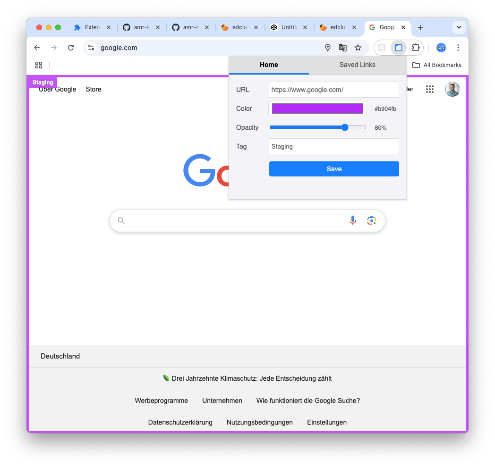
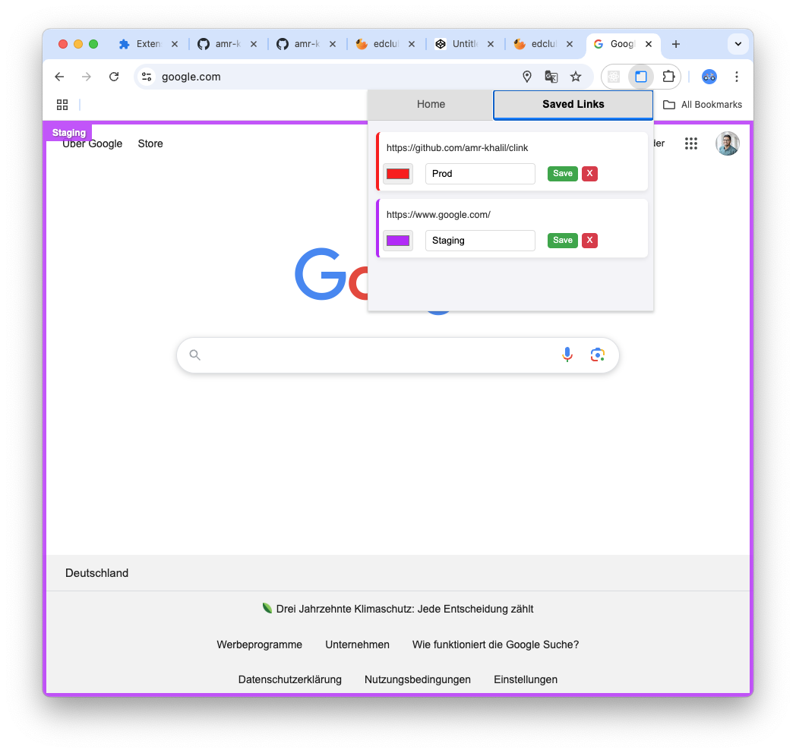

# CLink

URL Color Tagger Chrome Extension

A simple Chrome extension to add a configurable colored border, text tag, and opacity level to specific web pages, helping you visually distinguish between different environments (like Staging vs. Production) or categorize sites at a glance.

## Features

- **Assign Custom Colors:** Choose any color using a color picker for the page border and tag background.
- **Set Descriptive Text Tags:** Add a short text label (e.g., "DEV", "PROD", "QA") displayed in the top-left corner.
- **Adjust Opacity:** Control the transparency of the border and tag using a slider (0% to 100%).
- **Automatic Application:** The border and tag appear automatically when you visit a saved URL.
- **Easy Management:**
  - Add/Update tags for the _current_ page via the popup.
  - View, edit, and delete _all_ saved tags in the "Saved Links" tab.
- **Dynamic Updates:** If a tag is added/updated/removed (via popup or sync) while a tagged page is open, the view updates automatically.

## Why?

Ever accidentally made a change on a production website thinking you were on staging? Or needed a quick visual cue to know which client's admin panel you're looking at? This extension provides a clear, persistent visual indicator directly on the page to prevent such mistakes and improve context awareness.

## Screenshots

## How to Use

1.  **Navigate:** Go to the web page you want to tag.
2.  **Open Popup:** Click the "URL Color Tagger" icon in your Chrome toolbar.
3.  **Configure:**
    - Use the color picker to select your desired border/tag color.
    - Adjust the opacity slider for the desired visibility.
    - Enter a short, descriptive text in the "Tag" field.
4.  **Save:** Click the "Save" button. The border and tag should appear immediately on the current page.
5.  **Manage:**
    - To change the tag for the current page, simply modify the values in the popup and click "Save" again.
    - To view, edit, or delete all saved tags, click the "Saved Links" tab in the popup. Make changes directly in the list and click the small "Save" button for that row, or click the "X" button to delete.

## Contributing

Bug reports, feature suggestions, and pull requests are welcome! Please open an issue on the repository's GitHub page to discuss changes or report problems.

## License

This project is licensed under the MIT License - see the [LICENSE](LICENSE) file (if one exists) or the header in the source files for details.
